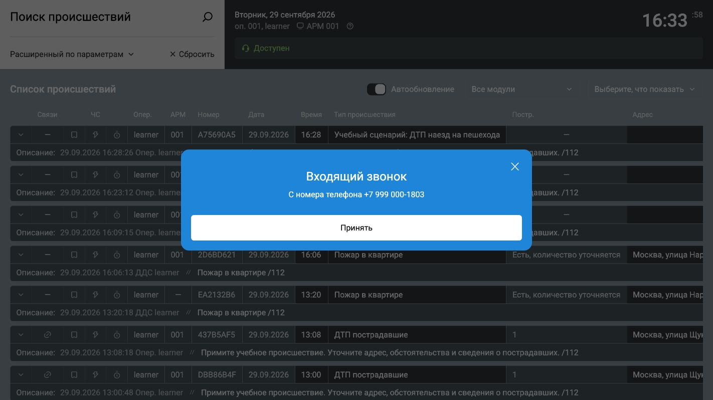
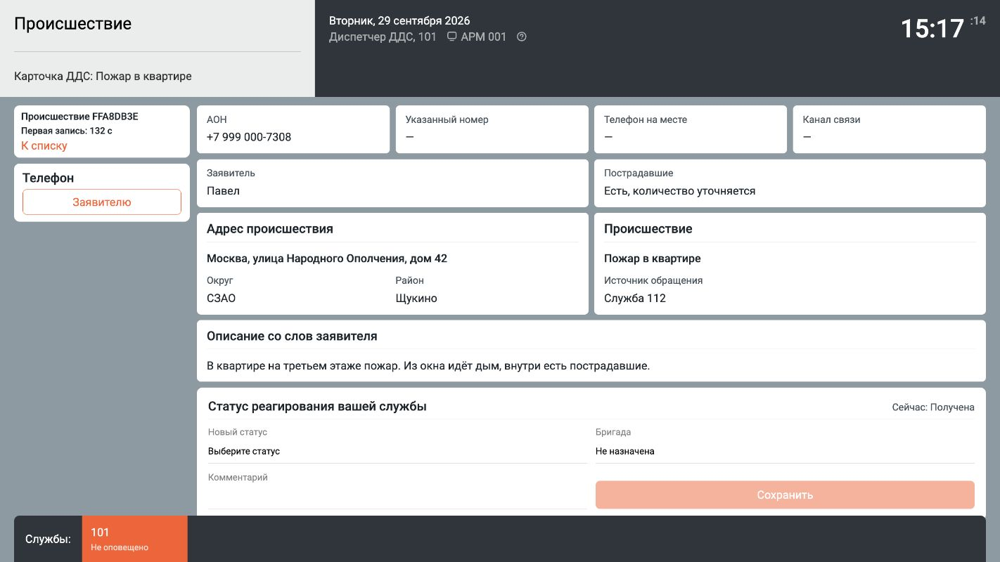
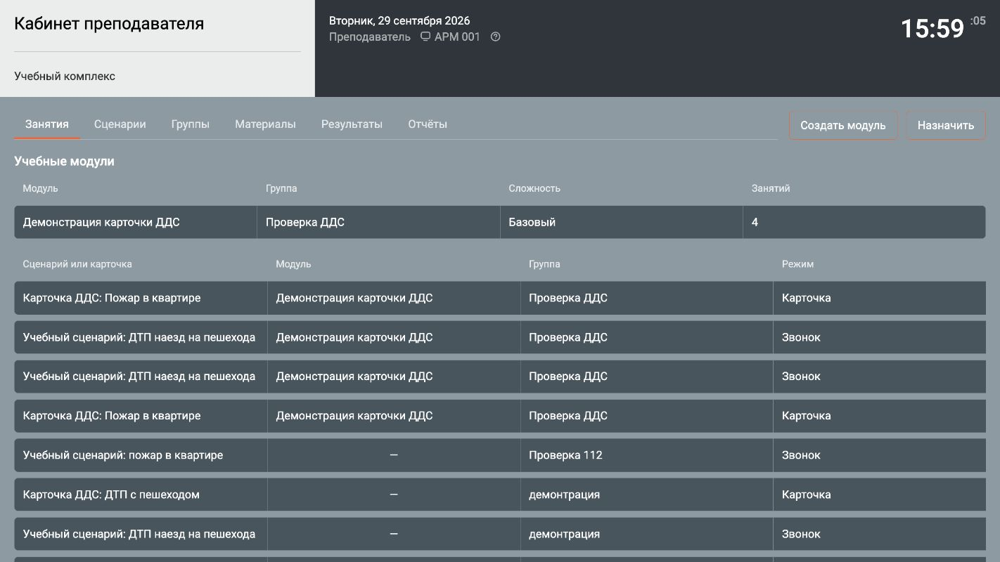

# Тренажёр Системы-112

Программу можно проверить на сайте [online.tindapp.com](https://online.tindapp.com). Для входа в рабочее место администратора укажите:

| Поле | Значение |
|---|---|
| Логин | `admin` |
| Пароль | `12345678` |
| Номер АРМ | `1` |

## 1 Назначение

Тренажёр предназначен для занятий с операторами 112 и диспетчерами дежурно-диспетчерских служб (ДДС). Преподаватель готовит сценарии, формирует группы, назначает занятия и просматривает результаты. Обучающийся принимает учебный звонок, разговаривает с заявителем и заполняет карточку происшествия либо обрабатывает готовую карточку от имени ДДС. Администратор создаёт учётные записи и управляет работой комплекса.

Один комплекс охватывает разговор оператора 112, оформление карточки, реагирование ДДС и разбор результата. Речевые модели распознают слова оператора и определяют смысл нескольких вопросов в одной реплике с учётом хода разговора. Ответы заявителя воспроизводятся голосом. При оценке учитываются содержание карточки, действия обучающегося и время их выполнения. Преподаватель видит конкретные ошибки и может назначить повторную отработку.

Программа открывается в браузере; звонки оператора и телефон ДДС звучат на рабочем месте обучающегося. Речевые модели работают на CPU без GPU, поэтому для учебного комплекса не требуется сервер с видеокартой. На рабочих местах приложение устанавливать не нужно. Комплекс размещается в сети учебного центра.

### 1.1 Рабочие места

Обучающийся принимает входящий учебный звонок в рабочем месте оператора 112.



*Рисунок 1 — Входящий учебный звонок.*

Диспетчер ДДС получает готовую карточку. Телефон, сведения о заявителе, адрес, происшествие и статус своей службы находятся на одном экране.



*Рисунок 2 — Карточка диспетчера ДДС.*

Преподаватель назначает занятия группе и контролирует их выполнение.



*Рисунок 3 — Занятия преподавателя.*

## 2 Условия работы

Для установки на сервере нужны Linux x86-64, Git, Docker Engine с Docker Compose, Python 3, OpenSSL, постоянный IPv4-адрес в локальной сети и свободный порт 443. [Порядок установки Docker Engine и Compose для Ubuntu](https://docs.docker.com/engine/install/ubuntu/) приведён в документации Docker. Для других дистрибутивов используйте соответствующий раздел документации Docker.

| Параметр | Сервер | Рабочее место |
|---|---|---|
| Процессор | От 6 ядер x86-64 | От 2 ядер |
| Оперативная память | От 32 ГБ | От 4 ГБ |
| Накопитель | NVMe SSD от 512 ГБ | Дополнительное место не требуется |
| Сеть | Постоянный IPv4-адрес, доступный рабочим местам | Подключение к локальной сети |
| Звук | Не требуется | Гарнитура с микрофоном |

GPU не требуется. На рабочих местах используют актуальный Chrome, Firefox или Яндекс.Браузер. Программу и речевые модели на них не устанавливают.

## 3 Установка в локальной сети

### 3.1 Подготовка сервера

Получите исходный комплект и перейдите в его каталог:

```bash
git clone https://github.com/BlusteryS/Training112.git
cd Training112
```

Сборка впервые загружает образы, зависимости и речевые модели из интернета. Если комплекс будет работать в изолированной сети, выполните сборку до отключения доступа к интернету.

### 3.2 Адрес, сертификат и запуск

Убедитесь, что у сервера есть постоянный IPv4-адрес в локальной сети и порт 443 доступен рабочим местам. Затем выполните в обычном интерактивном терминале:

```bash
python3 deploy/setup.py
docker compose up -d --build
docker compose ps
```

Первая команда запросит IPv4-адрес, создаст сертификаты в `deploy/tls` и файл `.env`. В `.env` записываются только адрес сервера и автоматически созданный пароль PostgreSQL. Повторный запуск настройки сохраняет пароль базы и сертификат локального центра сертификации.

Первая сборка может занять продолжительное время: в неё входит загрузка речевых моделей. В выводе `docker compose ps` сервисы `db`, `speech`, `backend` и `web` должны получить состояние `healthy`; `worker` и `backup` должны работать. Комплекс доступен по адресу `https://IP-АДРЕС-СЕРВЕРА`.

### 3.3 Сертификат для браузеров

Микрофон в браузере доступен странице, открытой через HTTPS. Обычный `http://` с IP-адресом сервера для звонка не подходит. При работе без домена `deploy/setup.py` создаёт свой центр сертификации и выдаёт от его имени сертификат серверу. Чтобы браузеры доверяли этому сертификату, на каждом рабочем месте нужно один раз установить **только** файл `deploy/tls/ca.crt`.

В Windows откройте `ca.crt`, выберите «Установить сертификат» и поместите его в «Доверенные корневые центры сертификации». Для установки на весь компьютер нужны права администратора Windows.

В Ubuntu перенесите `ca.crt` на рабочее место и выполните там:

```bash
sudo cp ca.crt /usr/local/share/ca-certificates/training112.crt
sudo update-ca-certificates
```

Если Firefox или другой браузер использует собственное хранилище сертификатов, импортируйте `ca.crt` в его настройках как доверенный центр сертификации. Перезапустите браузер, откройте `https://IP-АДРЕС-СЕРВЕРА` и проверьте, что предупреждения о сертификате нет. После принятия звонка разрешите сайту доступ к микрофону.

Файлы `ca.key`, `server.key` и `.env` остаются на сервере. Передавать их на рабочие места не требуется. Для [online.tindapp.com](https://online.tindapp.com) установка локального сертификата не нужна: этот экземпляр уже открывается по HTTPS.

Сертификат сервера действует один год. Для перевыпуска с тем же IP-адресом выполните `python3 deploy/setup.py` и `docker compose up -d --force-recreate web`. Установленный на рабочих местах `ca.crt` при этом не меняется. Если изменился IP-адрес сервера, после настройки пересоздайте также backend: `docker compose up -d --force-recreate backend web`.

### 3.4 Первый администратор

На новом сервере создайте администратора в интерактивном терминале:

```bash
docker compose exec backend create-admin
```

Введите логин, пароль и подтверждение по запросам программы. Пароль при вводе не отображается. После сообщения об успешном создании откройте адрес из пункта 3.2. На странице входа укажите логин, пароль и номер АРМ от одной до четырёх цифр. Номер АРМ показывается в сеансе и не требует предварительной регистрации.

## 4 Проверка полного учебного цикла

Для проверки используйте две независимые сессии браузера: одну для преподавателя, другую для обучающегося. Подойдут разные браузеры либо обычное и приватное окна. В одной сессии вход под другой учётной записью завершит предыдущий сеанс.

### 4.1 Пользователи и группа

1. Войдите администратором. Во вкладке «Пользователи» нажмите «Создать» и создайте одного преподавателя и одного обучающегося. Для каждого задайте отдельный логин и пароль.
2. В отдельной сессии войдите преподавателем. Во вкладке «Группы» нажмите «Создать», укажите название и службу `101`. Откройте «Состав» и добавьте обучающегося. Код службы группы определяет, от имени какой ДДС он будет обрабатывать карточку.

### 4.2 Сценарий и занятие оператора 112

1. Во вкладке «Сценарии» нажмите «Создать». Для проверки выберите происшествие, по которому оповещается служба 101, например пожар. Укажите место, сведения о заявителе и обстоятельства происшествия. Нажмите «Продолжить».
2. Проверьте подготовленные ответы заявителя и критерии оценки; при необходимости исправьте сведения. Нажмите «Сохранить». Сервер проверит сценарий и подготовит голосовые фразы. Когда появится состояние «Готов к утверждению», нажмите «Утвердить».
3. Во вкладке «Занятия» нажмите «Назначить». Выберите созданную группу, режим «Звонок оператора 112» и утверждённый сценарий. Нажмите «Назначить», затем «Запустить» у занятия.
4. Во второй сессии войдите обучающимся и укажите номер АРМ. Установите состояние «Доступен», примите входящий звонок и разрешите доступ к микрофону. Задавайте заявителю вопросы и заполняйте карточку по его ответам. Укажите тип и признаки происшествия, адрес, описание и сведения о пострадавших. Проверьте предложенные службы; при необходимости измените их вручную.
5. Завершите разговор кнопкой с трубкой. Нажмите «Сохранить», проверьте список получателей в окне подтверждения и подтвердите передачу карточки. Если обязательное поле не заполнено, вернитесь к карточке и исправьте его.
6. Откройте «Мои результаты» в сессии обучающегося. В сессии преподавателя откройте «Результаты» и «Отчёты»: там доступны проверка карточки, ошибки и экспертная оценка. После проверки завершите занятие.

Карта вызывается из блока адреса карточки и открывается поверх неё в том же окне браузера. Щёлкните по месту происшествия и нажмите «Указать точку». Координаты сохраняются всегда; адрес определяется по местной базе адресных точек. При необходимости исправьте адрес в карточке. Подсказки при вводе адреса берутся из ФИАС.

### 4.3 Занятие диспетчера ДДС

1. Во вкладке «Занятия» снова нажмите «Назначить». Выберите ту же группу и режим «Карточка диспетчера ДДС». Для первого занятия выберите «Заполнить карточку». Укажите тип происшествия, телефон заявителя, адрес и описание. Выберите верное первичное решение «Принять» и исход «Работы завершены». Назначьте и запустите занятие.
2. В сессии обучающегося откройте поступившую карточку в течение 30 секунд. Она доступна только для чтения. В течение 3 минут после поступления внесите первую запись: статус «Принята» и комментарий. Выберите бригаду.
3. В блоке «Телефон» при необходимости свяжитесь с руководителем, укажите название или номер бригады, затем позвоните её старшему либо ответьте на его входящий звонок. После выбора собеседника произнесите реплику в микрофон и нажмите «Закончить реплику»; разговор также продолжается автоматически через 10 секунд. После докладов последовательно установите статусы «Начало реагирования», «Прибытие», «Проведение работ», «Работы завершены». При завершении укажите результат в комментарии. Для случая без выезда бригады можно получить отказ руководителя и записать «Отказ от выполнения работ» с причиной. Если бригада сообщила об ошибке в адресе, передайте уточнение оператору 112 по телефону. Карточка 112 диспетчеру ДДС доступна только для чтения. При необходимости можно позвонить заявителю.
4. Проверьте результат в «Моих результатах» и во вкладках преподавателя «Результаты» и «Отчёты». Завершите занятие.

Для проверки передачи ранее сохранённой карточки 112 вместо «Заполнить карточку» выберите «Подборка карточек». Отметьте сохранённую карточку оператора, направленную службе группы, и ещё один доступный источник. В подборке должно быть не менее двух карточек. Они выдаются обучающемуся по одной в случайном порядке.

Для проверки отказа создайте отдельное занятие ДДС с верным первичным решением «Не принимать». Обучающийся должен выбрать «Не принята» и записать причину в комментарии. После отказа карточку можно принять; редактировать её содержание диспетчер не может.

## 5 Работа с комплексом

### 5.1 Сценарии и материалы

Преподаватель создаёт сценарии для разговора оператора 112. После каждого изменения сценарий проходит подготовку и требует повторного утверждения. Утверждённый сценарий можно перенести через «JSON» и «Импорт». Скрытие сценария не удаляет историю проведённых занятий.

Во вкладке «Материалы» преподаватель размещает учебные файлы для группы. Критерии оценки и допустимое число ошибок задаются при подготовке сценария. Экспертную оценку завершённой попытки преподаватель записывает во вкладке «Результаты».

### 5.2 Права и состояние системы

Администратор управляет пользователями во вкладке «Пользователи». Для изменения роли или доступа откройте «Изменить» напротив учётной записи. Во вкладках «Состояние», «Журнал» и «Статистика» доступны сведения о работе комплекса. «Политика доступа» задаёт длину пароля и срок сеанса. «Параметры комплекса» управляют учебными сервисами, хранением журнала и расписанием автоматического резервного копирования. Во вкладке «Резервные копии» доступны сведения о сохранённых копиях и экспорт данных без хешей паролей.

Отдельной роли ДДС в учётных записях нет: обучающийся получает службу из своей группы. Диспетчер меняет статусы только этой службы. Если занятия созданы по одной сохранённой карточке оператора 112, в ней видны последние статусы остальных оповещённых служб.

### 5.3 Обновление и остановка

Перед обновлением завершите активные занятия. В каталоге проекта на сервере выполните:

```bash
git pull
docker compose up -d --build
```

Файл `.env`, сертификаты и постоянные тома при обновлении сохраняются. Чтобы просмотреть состояние и журналы, выполните:

```bash
docker compose ps
docker compose logs --tail=100 backend speech worker web
```

Для остановки используйте `docker compose down`. Постоянные тома при этом сохраняются. Автоматические копии базы помещаются в том `backup_data`; интервал и число хранимых копий задаёт администратор во вкладке «Параметры комплекса».

## 6 Действия при неполадках

| Состояние | Действие |
|---|---|
| Страница не открывается | Проверьте адрес сервера, доступность порта 443 и состояние `web` через `docker compose ps`. |
| Браузер предупреждает о сертификате | Откройте адрес с тем IP, который указан при настройке; установите `ca.crt` по пункту 3.3. |
| Микрофон недоступен | Откройте страницу через HTTPS, подключите гарнитуру и разрешите доступ к микрофону в браузере и ОС. |
| Сценарий не готов к утверждению | Дождитесь завершения подготовки; при ошибке проверьте `docker compose logs --tail=100 worker`. |
| Обучающемуся не поступает занятие | Проверьте состав группы, состояние занятия и режим «Доступен» у обучающегося. |
| Карточка не сохраняется | Проверьте обязательные поля и список служб в окне подтверждения. |
| Доклад бригады не принят | Дождитесь окончания звукового сообщения старшего и установите статус, соответствующий сообщённому этапу. |

## 7 Состав комплекса

| Компонент | Назначение |
|---|---|
| `site`, контейнер `web` | Интерфейс, микрофон, воспроизведение звука и HTTPS. |
| `backend` | Java/Vert.x: вход, учебные данные и передача звука. |
| `speech` | Python и ONNX Runtime: Silero VAD выделяет реплики, T-One распознаёт русскую речь, контекстная модель определяет смысл вопросов для диалога по сценарию. |
| `worker` | Проверка сценария, синтез голоса заявителя с помощью Piper и оценка карточки и действий обучающегося. |
| `db` | PostgreSQL: пользователи, сценарии, карточки, события и результаты. |
| `backup` | Автоматическое сохранение базы. |

`worker` и `speech` используют один образ с речевыми библиотеками и моделями. Голосовые ответы готовятся до занятия; во время звонка воспроизводятся готовые фрагменты. Сервер не обращается к облачной модели. Пароли пользователей хранятся как хеши Argon2id; сеансы браузера используют HttpOnly cookie.
