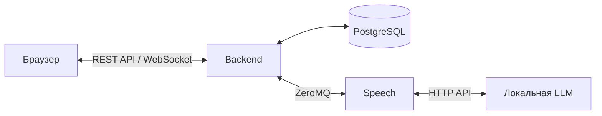
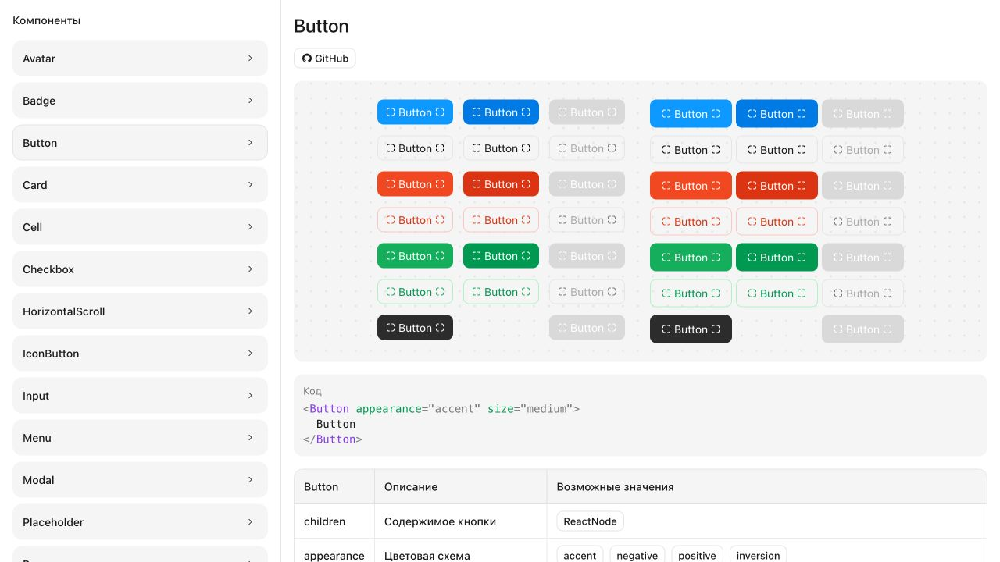
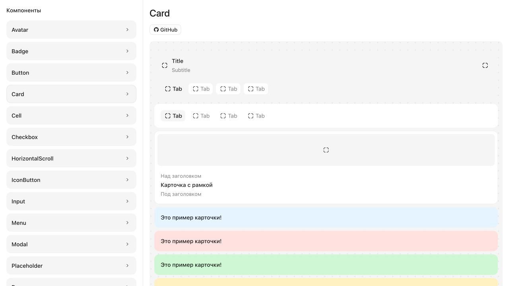

# Training112

Training112 — тренажёр телефонных разговоров для операторов 112. Оператор говорит в микрофон, модель отвечает за заявителя. Сценарий происшествия, адрес и характер звонящего задаются в конфигурации. Голос выбирается случайно при каждом звонке.

Распознавание, диалог и синтез речи работают локально. Ответ поступает в браузер по частям: воспроизведение начинается, пока модель ещё продолжает его составлять. Это сокращает паузу между репликами. Микрофон при этом остаётся включённым, поэтому звонящего можно перебить.

Сайт и речевой сервис Speech связаны через ZeroMQ. Аудио передаётся бинарными пакетами, размер очередей ограничен. Для большего числа разговоров можно добавить GPU-серверы — backend распределяет между ними новые звонки.

## Стек

| Часть проекта | Технологии |
| --- | --- |
| Frontend | React 19, TypeScript, Vite, React Router |
| UI библиотека | `@training112/components`, CSS Modules, `@training112/icons` |
| Backend | Java 25, Vert.x, REST API, WebSocket |
| База данных | PostgreSQL, Flyway |
| Речевой сервис | Python, PyTorch, CUDA, ZeroMQ |
| Определение реплик | Silero VAD |
| Распознавание речи | GigaAM |
| Синтез голоса | Qwen3-TTS 1.7B Base |
| Диалог | Локальная LLM с OpenAI-совместимым API; в инструкции — Qwen3-8B через llama.cpp |
| Запуск | Docker Compose, Nginx |

## Схема



Вход и данные профиля работают через REST API. Для разговора браузер открывает WebSocket-соединение. Backend передаёт звук в Speech, где речь распознаётся и озвучивается ответ модели.

## UI библиотека

Для интерфейса написана своя UI библиотека — `@training112/components`. Иконки лежат в `@training112/icons`. Есть светлая и тёмная темы. Каталог компонентов с примерами кода доступен на сайте по адресу `/ui` после входа.





## Установка

### На одном компьютере

Инструкция рассчитана на Linux с видеокартой NVIDIA. Заранее установите драйвер, [Docker с Compose](https://docs.docker.com/engine/install/) и [NVIDIA Container Toolkit](https://docs.nvidia.com/datacenter/cloud-native/container-toolkit/latest/install-guide.html). Последний нужен, чтобы Docker мог использовать видеокарту. В инструкции NVIDIA пройдите установку и настройку Docker.

Скачайте проект и создайте файл настроек:

```sh
git clone https://github.com/BlusteryS/Training112.git
cd Training112
cp .env.example .env
```

В `.env` задайте `DB_PASSWORD` — любой свой пароль для локальной базы. Саму PostgreSQL создаст Docker на этом компьютере. Пароль нужен backend для доступа к ней. Для входа на сайт будет другой пароль, его зададим ниже.

Две другие настройки уже заполнены: `APP_ORIGIN` — адрес сайта, `SPEECH_LLM_URL` — адрес модели, которая отвечает за диалог. Для команд ниже их менять не нужно.

Запустите сайт и Speech:

```sh
docker compose up -d --build
```

При первом запуске Docker собирает проект, а Speech скачивает модели распознавания и синтеза речи. Файлы сохраняются, повторно скачивать их при каждом запуске не нужно.

Теперь запустите модель диалога. В этом примере используется [Qwen3-8B](https://huggingface.co/Qwen/Qwen3-8B-GGUF), а запускает её [llama.cpp](https://github.com/ggml-org/llama.cpp/tree/master/tools/server). Команда сама скачает модель:

```sh
docker run -d --name training112-llm --restart unless-stopped \
  --gpus all --network training112_default \
  -v training112_llm_cache:/root/.cache/llama.cpp \
  ghcr.io/ggml-org/llama.cpp:server-cuda \
  -hf Qwen/Qwen3-8B-GGUF:Q4_K_M \
  --alias local-model --host 0.0.0.0 --port 8080 \
  --jinja --reasoning-budget 0
```

Имя модели и подключение уже совпадают с настройками проекта. Qwen3-8B и Speech используют одну видеокарту, поэтому в её памяти должны помещаться обе части.

Загрузка может занять время. Посмотреть, что происходит, можно через `docker logs -f training112-llm` и `docker compose logs -f speech`. Сообщение `Speech ready` означает, что речевой сервис готов. Из просмотра логов можно выйти через `Ctrl+C`.

После загрузки моделей создайте аккаунт:

```sh
docker compose exec backend create-admin admin
```

Введите пароль для сайта два раза, от 8 до 128 символов. Логин — `admin`.

Откройте [localhost:8080](http://localhost:8080) и войдите. В профиле нажмите «Начать сеанс» и разрешите доступ к микрофону. Звонок начнётся автоматически, когда освободится речевой сервер. Во время поиска показывается примерное время ожидания.

### На нескольких серверах

Speech можно вынести на другую машину, оставив сайт и базу на прежней. Если одного речевого сервера мало, подключите несколько.

#### Речевые серверы

На каждой машине со Speech нужны те же Docker, драйвер NVIDIA и Container Toolkit. Скачайте проект и создайте настройки в папке `speech`:

```sh
cd Training112/speech
cp .env.example .env
```

В `speech/.env` укажите:

```dotenv
SPEECH_LLM_URL=http://10.20.0.10:8081/v1
SPEECH_LISTEN_ADDRESS=10.20.0.11
SPEECH_MAX_SESSIONS=1
```

В примере модель диалога находится на `10.20.0.10:8081`, а Speech — на `10.20.0.11`. Подставьте свои внутренние адреса. `SPEECH_MAX_SESSIONS=1` разрешает один разговор на этом сервере.

Если LLM остаётся на машине с сайтом, откройте её порт для Speech. Остановите контейнер командой `docker stop training112-llm`, удалите его через `docker rm training112-llm` и повторите команду `docker run` выше. Перед именем образа добавьте `-p 10.20.0.10:8081:8080`, указав внутренний IP машины с LLM. Файлы модели сохранятся в томе `training112_llm_cache`. Доступ к порту `8081` разрешите только речевым серверам.

Запустите Speech:

```sh
docker compose up -d --build
```

#### Сайт

В основном `.env` на машине с сайтом добавьте адреса Speech через запятую:

```dotenv
SPEECH_ENDPOINTS=tcp://10.20.0.11:5555,tcp://10.20.0.12:5555
```

Из корня проекта запустите сайт с локальной базой:

```sh
docker compose up -d --build db backend web
```

Если раньше Speech работал здесь же, дождитесь завершения его разговоров и выполните `docker compose stop speech` из корня проекта.

Backend выбирает сервер при подключении. Весь разговор проходит на нём же. На всех машинах должны совпадать версия Speech и набор голосов.

Для доступа по домену укажите его в `APP_ORIGIN`, например `https://training.example.org`, и выполните `docker compose up -d backend`. Перед портом `8080` настройте HTTPS-прокси с поддержкой WebSocket. HTTPS нужен браузеру для работы с микрофоном вне localhost.

Для связи между серверами используйте частную сеть. Порт Speech `5555` откройте только для backend.

<details>
<summary>Шифрование связи со Speech</summary>

Для шифрования в ZeroMQ используется CURVE. Нужны две пары ключей: одна для Speech, другая для backend. Выполните эту команду два раза из папки `speech`:

```sh
docker compose run --rm --no-deps --entrypoint python speech -c 'import zmq; public, secret = zmq.curve_keypair(); print("public=" + public.decode()); print("secret=" + secret.decode())'
```

В основной `.env` добавьте:

```dotenv
SPEECH_CURVE_SERVER_KEY=<public из пары Speech>
SPEECH_CURVE_PUBLIC_KEY=<public из пары backend>
SPEECH_CURVE_SECRET_KEY=<secret из пары backend>
```

В `speech/.env` каждой ноды:

```dotenv
SPEECH_NODE_PUBLIC_KEY=<public из пары Speech>
SPEECH_NODE_SECRET_KEY=<secret из пары Speech>
SPEECH_CLIENT_PUBLIC_KEYS=<public из пары backend>
```

Примените настройки командой `docker compose up -d` из папки `speech`, а на сервере сайта — `docker compose up -d backend`. Секретные ключи храните в `.env`.

</details>
